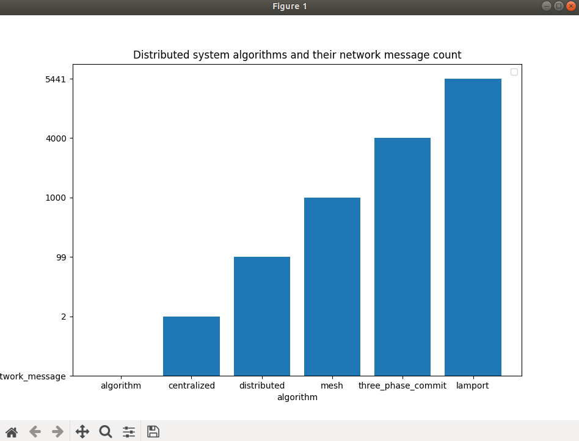
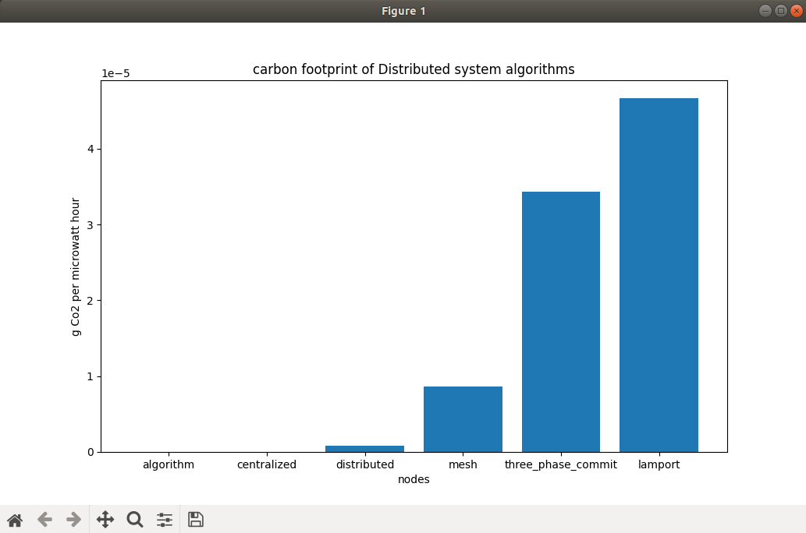
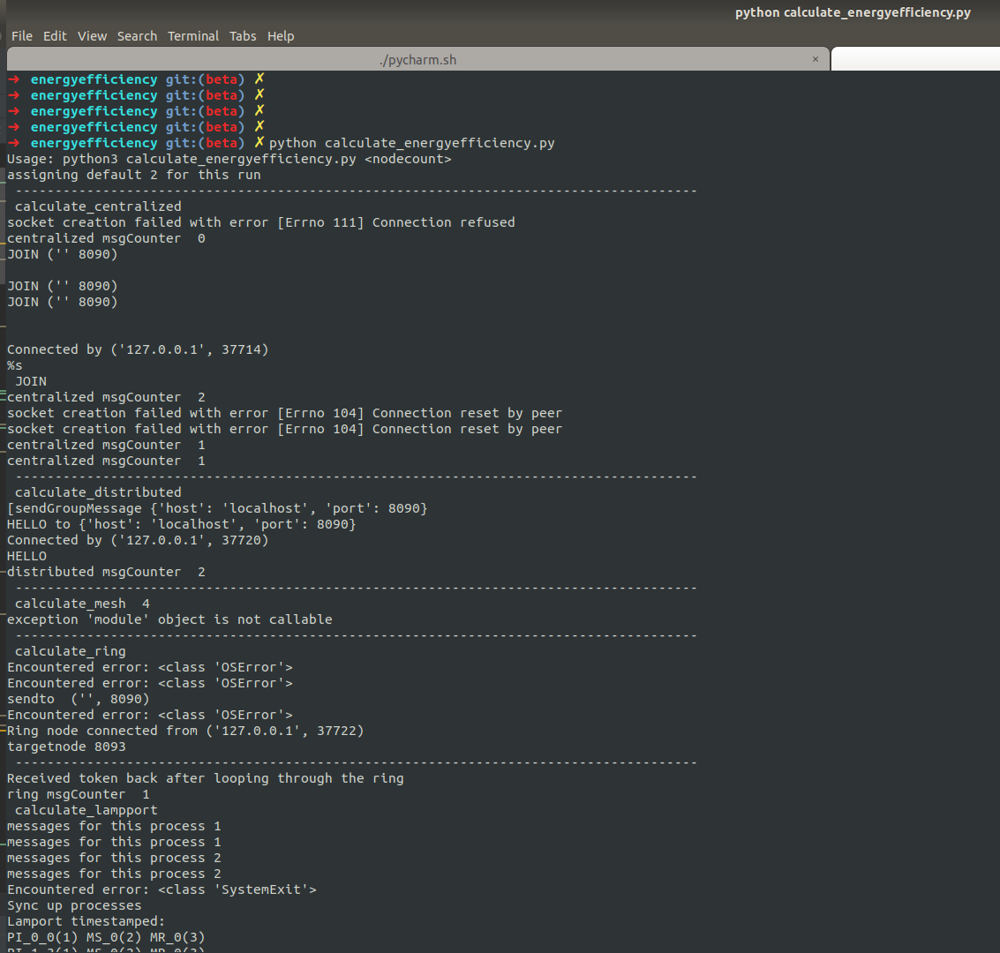
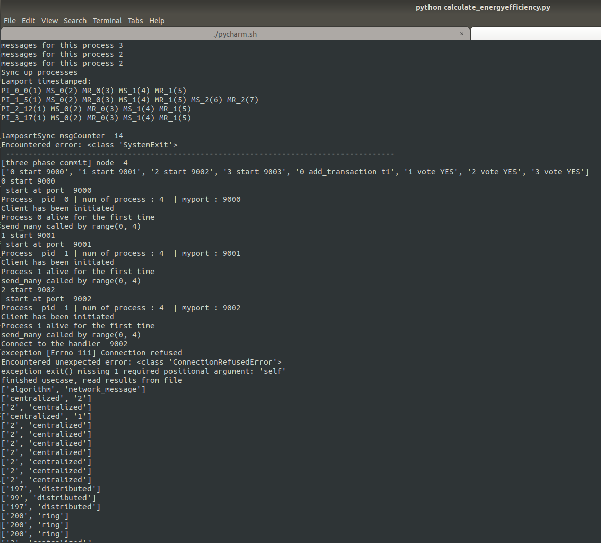

# Energy Efficiency in Distributed system algorithms

## Network traffic Analyzer

## Carbon Emission

EPA’s eGRID emission factors based on 2018 data published in 2020 US average electricity source emissions of 0.947 lbs
CO2e per kWh (0.429 kgs CO2e per kWh).
which is 0.000000429 g Co2 per microwatt hour

## Algorithms 

**Centralized**
Trace output for every client server interaction

    python3 centralized.py 'localhost' 7000
    
    Executing script name = 'centralized.py'...
    
    JOIN ('127.0.0.1' 7000)
    
     msgCounter  2

**Distributed**
Also used during flooding

Trace output with 2 nodes

    python3 distributed.py 2
    6000
    6000
    [{'host': 'localhost', 'port': 6000}, {'host': 'localhost', 'port': 6000}]
    
    Executing script name = 'distributed.py'...
    
    HELLO to {'host': 'localhost', 'port': 6000}
    ('OK', "Happy to meet you, ('127.0.0.1', 50620)")
    HELLO to {'host': 'localhost', 'port': 6000}
    ('OK', "Happy to meet you, ('127.0.0.1', 50622)")
     msgCounter  4

Trace output with 10 nodes

    python3 distributed.py 10
    6000
    6000
    6000
    6000
    6000
    6000
    6000
    6000
    6000
    6000
    [{'host': 'localhost', 'port': 6000}, {'host': 'localhost', 'port': 6000}, {'host': 'localhost', 'port': 6000}, {'host': 'localhost', 'port': 6000}, {'host': 'localhost', 'port': 6000}, {'host': 'localhost', 'port': 6000}, {'host': 'localhost', 'port': 6000}, {'host': 'localhost', 'port': 6000}, {'host': 'localhost', 'port': 6000}, {'host': 'localhost', 'port': 6000}]
    
    Executing script name = 'distributed.py'...
    
    HELLO to {'host': 'localhost', 'port': 6000}
    ('OK', "Happy to meet you, ('127.0.0.1', 50632)")
    HELLO to {'host': 'localhost', 'port': 6000}
    ('OK', "Happy to meet you, ('127.0.0.1', 50634)")
    HELLO to {'host': 'localhost', 'port': 6000}
    ('OK', "Happy to meet you, ('127.0.0.1', 50636)")
    HELLO to {'host': 'localhost', 'port': 6000}
    ('OK', "Happy to meet you, ('127.0.0.1', 50638)")
    HELLO to {'host': 'localhost', 'port': 6000}
    ('OK', "Happy to meet you, ('127.0.0.1', 50640)")
    HELLO to {'host': 'localhost', 'port': 6000}
    ('OK', "Happy to meet you, ('127.0.0.1', 50642)")
    HELLO to {'host': 'localhost', 'port': 6000}
    ('OK', "Happy to meet you, ('127.0.0.1', 50644)")
    HELLO to {'host': 'localhost', 'port': 6000}
    ('OK', "Happy to meet you, ('127.0.0.1', 50646)")
    HELLO to {'host': 'localhost', 'port': 6000}
    ('OK', "Happy to meet you, ('127.0.0.1', 50648)")
    HELLO to {'host': 'localhost', 'port': 6000}
    ('OK', "Happy to meet you, ('127.0.0.1', 50650)")
     msgCounter  20

*Ring*
Node 1 in Ring

    python3 ring.py 4 7000 7002
    {7000: {'host': 'localhost', 'port': 7000}, 7001: {'host': 'localhost', 'port': 7001}, 7002: {'host': 'localhost', 'port': 7002}, 7003: {'host': 'localhost', 'port': 7003}}
    
    Executing script name = 'ring.py'...
    
    currentNode  {'host': 'localhost', 'port': 7000}
    sendto  {'host': 'localhost', 'port': 7001}
    msgCounter  1

Node 2 in Ring

    python3 ring.py 3 7001 7002
    {7000: {'host': 'localhost', 'port': 7000}, 7001: {'host': 'localhost', 'port': 7001}, 7002: {'host': 'localhost', 'port': 7002}}
    
    Executing script name = 'ring.py'...
    
    currentNode  {'host': 'localhost', 'port': 7001}
    A ring node connected from ('127.0.0.1', 39422)
    Connected by ('127.0.0.1', 39422)
    received token  7002
    sendto  {'host': 'localhost', 'port': 7002}
    msgCounter  1

Node 3 in Ring

    python3 ring.py 4 7002 7002
    {7000: {'host': 'localhost', 'port': 7000}, 7001: {'host': 'localhost', 'port': 7001}, 7002: {'host': 'localhost', 'port': 7002}, 7003: {'host': 'localhost', 'port': 7003}}
    
    Executing script name = 'ring.py'...
    
    currentNode  {'host': 'localhost', 'port': 7002}
    A ring node connected from ('127.0.0.1', 573426)
    Connected by ('127.0.0.1', 573426)
    received token  7002
    sendto  {'host': 'localhost', 'port': 7000}
    msgCounter  1

    // Then send back to first node so msgCounter 2

Total message count in Ring with one way 3 nodes = 3

**Lamport time Sync**

Used by Lamport’s Distributed Mutual Exclusion Algorithm which is a permission based algorithm. Lamport’s Algorithm
requires invocation of 3(N – 1) messages per critical section execution.

for 3 concurrent processes each with upto 2 sync messages at each node

[PI(), MSs[0], PI(), MRs[1], MSs[2]],
[MRs[3], MRs[0], MSs[1]],
[MSs[3], PI(), MRs[2]]

o/p Lamport timestamped:

    PI_0_0(1) MS_0(2) PI_0_2(3) MR_1(5) MS_2(6) 
    MR_3(2) MR_0(3) MS_1(4) 
    MS_3(1) PI_2_9(2) MR_2(7)

    //Total message count 4 

For 3 concurrent processes each with randomly generated sync messages

    ➜ python3 LamportClock.py 4
      Lamport timestamped: 
      PI_0_0(1) MS_0(2) MR_0(3) MS_1(4) MR_1(5) MS_2(6) MR_2(7) 
      PI_1_7(1) MS_0(2) MR_0(3) MS_1(4) MR_1(5) MS_2(6) MR_2(7) 
      PI_2_14(1) MS_0(2) MR_0(3) MS_1(4) MR_1(5) 
      PI_3_19(1) MS_0(2) MR_0(3) MS_1(4) MR_1(5) MS_2(6) MR_2(7)

       //Total message count 16

For 10 concurrent processes each with 2 sync messages at each node

    Lamport timestamped: 
    PI_0_0(1) MS_0(2) MR_0(3) MS_1(4) MR_1(5) 
    PI_1_5(1) MS_0(2) MR_0(3) MS_1(4) MR_1(5) 
    PI_2_10(1) MS_0(2) MR_0(3) MS_1(4) MR_1(5) 
    PI_3_15(1) MS_0(2) MR_0(3) MS_1(4) MR_1(5) 
    PI_4_20(1) MS_0(2) MR_0(3) MS_1(4) MR_1(5) 
    PI_5_25(1) MS_0(2) MR_0(3) MS_1(4) MR_1(5) 
    PI_6_30(1) MS_0(2) MR_0(3) MS_1(4) MR_1(5) 
    PI_7_35(1) MS_0(2) MR_0(3) MS_1(4) MR_1(5) 
    PI_8_40(1) MS_0(2) MR_0(3) MS_1(4) MR_1(5) 
    PI_9_45(1) MS_0(2) MR_0(3) MS_1(4) MR_1(5) 
    
    // Total network message 20

Lamport’s Algorithm requires invocation of 3(N – 1) messages per critical section execution. These 3(N – 1) messages
involves

(N – 1) request messages
(N – 1) reply messages
(N – 1) release messages = 3(N-1) messages per critical section invocation.

**Bully Algorithm**

Chooses the node with the largest identifier to be leader. In Worst case:  process having the lowest priority number
detects the coordinator’s failure and initiates an Election stage message by new node : (n-2)
Network message count by n-1 nodes : (n-1)^2

initial state

    python3 bully_algorithm.py 'localhost' 51520 123456 
    Process ID: 123456
    STARTING WORK for pid 123456 on ('127.0.0.1', 45961)
    JOIN ('localhost', 51520), (123456, ('127.0.0.1', 45961))
    Starting an election at startup
    Leader is now unknown
    self: WAITING_FOR_OK
    Victory by 123456 no other bullies bigger than me
    Leader is now self
    self: QUIESCENT
    12:59:48.943458 (leader: self)

After 2 nodes joins network

    python3 bully_algorithm.py 'localhost' 51520 123456 
    Process ID: 123456
    STARTING WORK for pid 123456 on ('127.0.0.1', 45961)
    JOIN ('localhost', 51520), (123456, ('127.0.0.1', 45961))
    Starting an election at startup
    Leader is now unknown
    self: WAITING_FOR_OK
    Victory by 123456 no other bullies bigger than me
    Leader is now self
    self: QUIESCENT
    12:59:48.943458 (leader: self)
    
    61->26 (140029752690728): accepted [13:00:30.185980]
    61->26 (140029752690728): WAITING_FOR_ANY_MESSAGE
    61->26 (140029752690728): received COORDINATOR [13:00:30.186095]
    Leader is now somebody else
    61->26 (140029752690728): QUIESCENT
    13:00:30.186152 (leader: somebody else)
    
    self: QUIESCENT
    13:00:30.186182 (leader: somebody else)
    
    61->30 (140029752690728): accepted [13:00:43.929960]
    61->30 (140029752690728): WAITING_FOR_ANY_MESSAGE
    61->30 (140029752690728): received COORDINATOR [13:00:43.930066]
    Leader is now somebody else
    61->30 (140029752690728): QUIESCENT
    13:00:43.930119 (leader: somebody else)
    
    self: QUIESCENT
    13:00:43.930147 (leader: somebody else)

**2 PC**

Simulate a 2 phase commit protocol between n nodes. This program only simulates a good case and not a crash.

A successful operation involves

1. Voting phase : n-1 vote request and n-1 votes
2. Decision phase : n-1 decision and n-1 acks

For a 4 node system ( 1 coordinator and 3 participants ), msgCounter is 12

output:

      [three phase commit] node  4
      ['0 start 8090', '1 start 8091', '2 start 8092', '3 start 8093', '0 add_transaction t1', '1 vote YES', '2 vote YES', '3 vote YES']
      0 start 8090
       start at port  8090
      Process  pid  0 | num of process : 4  | myport : 8090
      WorkerThread
      Client has been initiated
      Process 0 alive for the first time
      send_many  called by range(0, 4)
      timed out waiting for vote-req
      starting re-election
      send_many  called by range(0, 4)

**3 PC**

A collection of processes, with 'internal ids' ranging from 0 to N-1, where N is the total number of 'backend'
processes. On eof the process who is the coordinator; it receives commands from client and directs a run of 3PC.

For a 4 node system ( 1 coordinator and 3 participants ) any successful operation involves

1. Voting phase : n-1 vote request and n-1 votes
2. dissemination phase : n-1 precommit request and n-1 responses
3. Decision phase : n-1 commit and n-1 acks

For a 4 node system ( 1 coordinator and 3 participants ), msgCounter is 18

Working of the Code

Each backend process listens on port 8090+i, where i is the process's 'internal id'. Every process has

- 1 thread listening on 8090+i for incoming msgs
- N threads maintaining sockets to each of the open ports. 5 timer threads, responsible for detecting various timeouts.

Note : this implementation doesnt handle VOTE-REQ properly. Is that msg is seen , please restart the execution.

## Output

**References**

[1] Performance Provisioning and Energy Efficiency in Cloud and Distributed Computing Systems ,A thesis submitted in fulfilment of the requirements for the degree of Doctor of Philosophy in the School of Information Technologies at The University of Sydney Nikzad Babaii Rizvandi January 2013

[2] State machine replication [Lamport 1978; Schneider 1990]
CodeSample: whong92/timestampSim.py https://gist.github.com/whong92/d0df440fbad880bc0221488eeedbb89f

[3] Computer Science and Engineering articles 
Arunachalam, A., Sornil, O. (2015) Issues of Implementing Random Walk and Gossip Based Resource Discovery Protocols in P2P MANETs & Suggestions for Improvement In: Procedia Computer Science (pp. 509-518). https://www.diva-portal.org/smash/get/diva2:1429063/FULLTEXT01.pdf

[4]three phase commit - https://www.cs.virginia.edu/~cr4bd/4414/S2020/twophase.html
- Code adapted heavily form https://github.com/dkmiller/3PC. (unlicensed Code )

[5] Raft Consensus Algorithm  https://raft.github.io/

[6] Center of Expertise for Energy Efficiency in Data Centers at the US Department of Energy’s Lawrence Berkeley National Laboratory in Berkeley, California. https://datacenters.lbl.gov/

[7] Paxos - Leslie Lamport [1998] [Lampson, 1996; Prisco et al., 1997;Lamport, 2001; van Renesse and Altinbuken, 2015]

[8] B. Mann and A. Arvavid, "Message complexity of distributed algorithms revisited," 2014 International Conference on Parallel, Distributed and Grid Computing, 2014, pp. 417-422, doi: 10.1109/PDGC.2014.7030782. https://ieeexplore.ieee.org/document/7030782

[9] Lamport -https://gist.github.com/whong92/d0df440fbad880bc0221488eeedbb89f

[10] Lectures and course  material from CPSC 5520, Seattle University by professor Kevin Lundeen